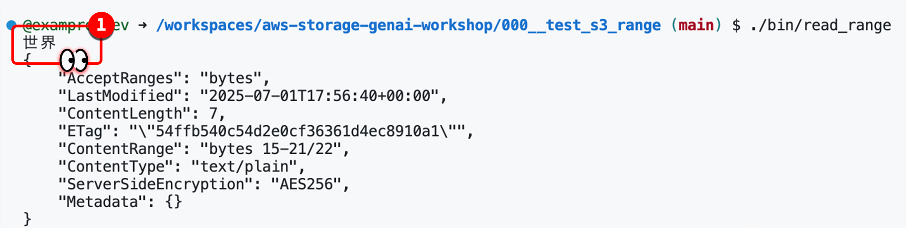

## Technical Uncertainty

We want to determine if we can read part of a file without downloading the entire file.
Amazon S3 suggests you can use a RANGE Http Header to specific the byte range to download.

### Upload File

We will upload a file called `hello_world.txt` to our bucket.

The contents of this file is `こんにちは世界`.

```bash
./bin/upload_file
```

### Read Part Of File

We will specfic the byte range to only read `世界`.

```bash
./bin/read_range
```

</img>


