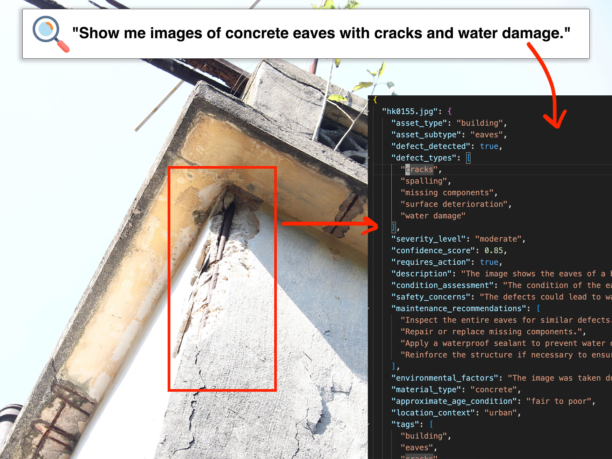
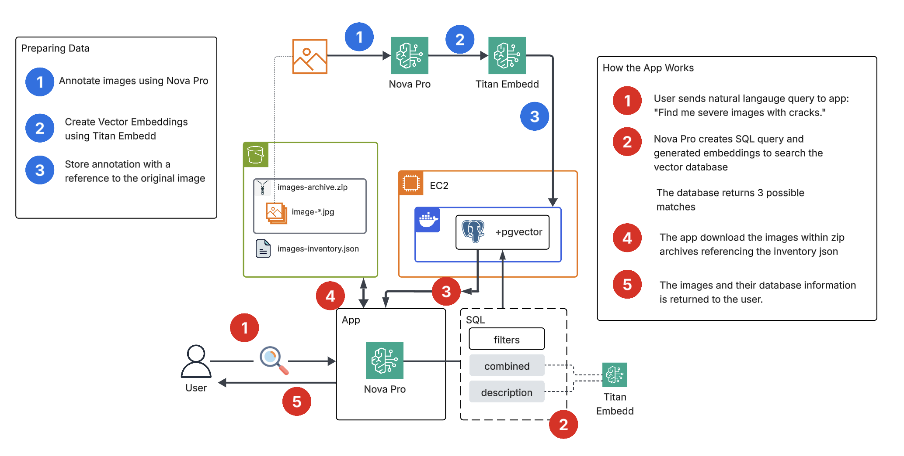

## Business Use-Case

An engineering firm needs to audit and track public infrastructure for safety via drone arial footage. They have captured tens of thousands of images (eg. cracks in bridges) and have stored them within archives based on year and month.

As a Cloud Engineer you have been tasked to building a proof-of-concept where you can use GenAI to use natural language to retrieve an image from the archive.

You need to report back possible technical paths and technical considerations for this project.

## Workshops Considertions

- All resources will be created in `ap-northeast-1` Asia Pacific (Tokyo)
- We'll be using GitHub Codespaces so we have a consistent developer enviroment 
- We are not using free-tier services but the cost should be under $1 USD for the duration of the workshop
- We'll be using the following repo: [https://github.com/ExamProCo/aws-storage-genai-workshop](https://github.com/ExamProCo/aws-storage-genai-workshop)

## Workshops Setup 

1. [Enable All Amazon Bedrock Models](https://ap-northeast-1.console.aws.amazon.com/bedrock/home?region=ap-northeast-1#/modelaccess) in `ap-northeast-1`
2. [Generate AWS Credentaisl for GitHub CodeSpaces](https://us-east-1.console.aws.amazon.com/iam/home?region=ap-northeast-1#/users)

3. Set AWS Credentials as GitHub secret variables:
  - AWS_ACCESS_KEY_ID
  - AWS_SECRET_ACCESS_KEY
  - AWS_DEFAULT_REGION

## Technical Uncertainty

- Can we extract specific bytes from an S3 file and read them?
  - [000__test_s3_range](./000__test_s3_range/Readme.md)
- Can we use Amazon Nova to generate mock images to vary our dataset?
  - [010__prepare_dataset/bin/000__generate](./010__prepare_dataset/bin/000__generate)
- Can we annotate the images in structure json output using Amazon Nova?
  - [010__prepare_dataset/bin/010__annotate](./010__prepare_dataset/bin/010__annotate)
- Can we extract a specific image file from a zip archive from s3 (without the need to download archive)
  - [010__prepare_dataset/bin/020__upload](./010__prepare_dataset/bin/020__upload)
  - [010__prepare_dataset/bin/030__download](./010__prepare_dataset/bin/030__download)
- Can we use Nova Titans to create embeddings for our vector search database?
  - [010__prepare_dataset/bin/040__embedd](./010__prepare_dataset/bin/040__embedd)
- Can we deploy pgvector database via container on a t3.micro?
  - [020__prepare_dataset](./020__prepare_dataset/Readme.md)
- Can we get Amazon Nova to generate our query to our vector database and return the results?
  - [030__agent_search](./030__agent_search/Readme.md)

## Technical Solution

## Public Dataset

We are using the CUBIT Infrastructure Defect Detection Dataset

https://github.com/BenyunZhao/CUBIT