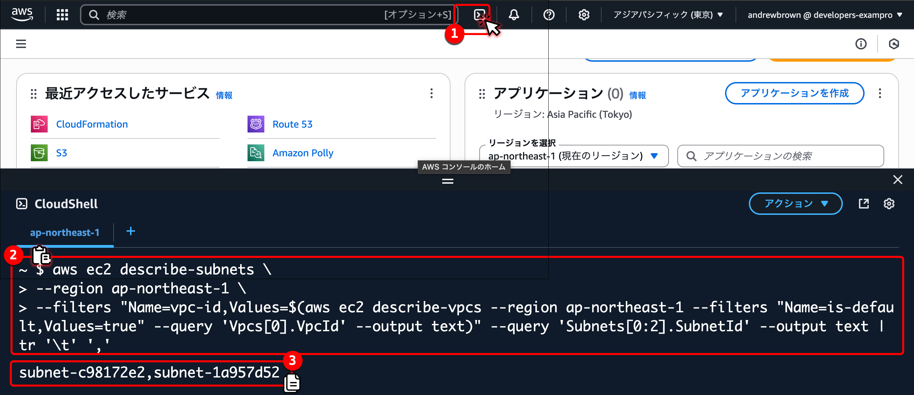
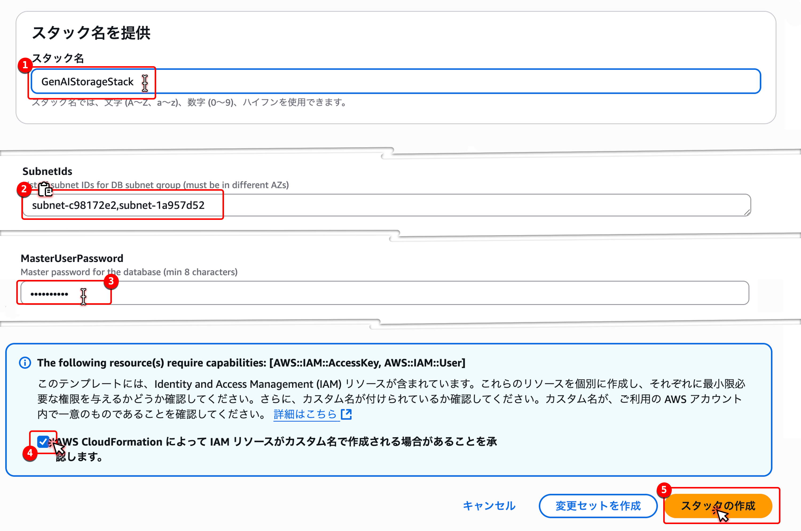
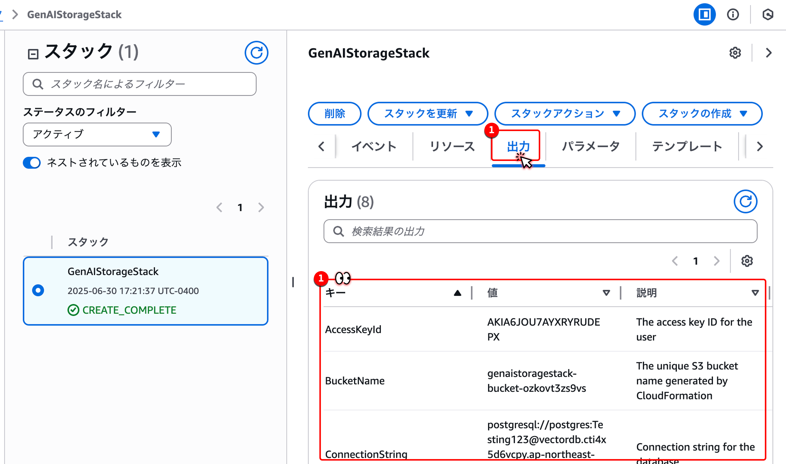
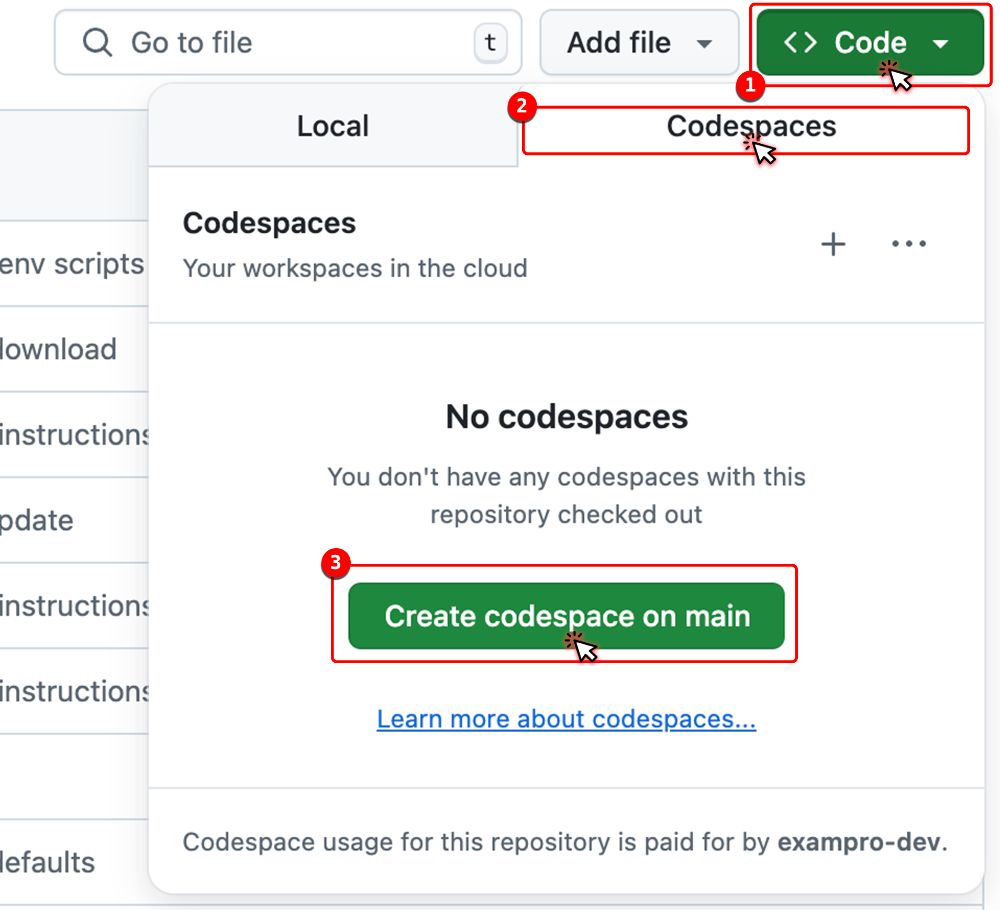
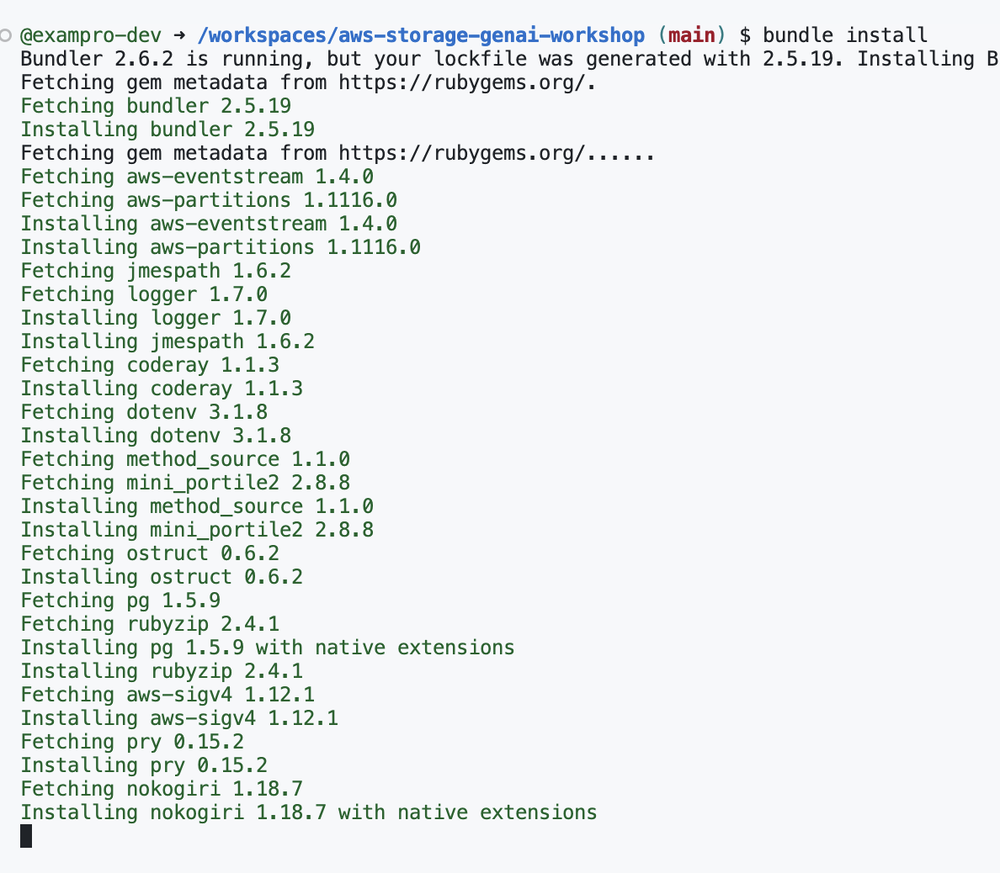
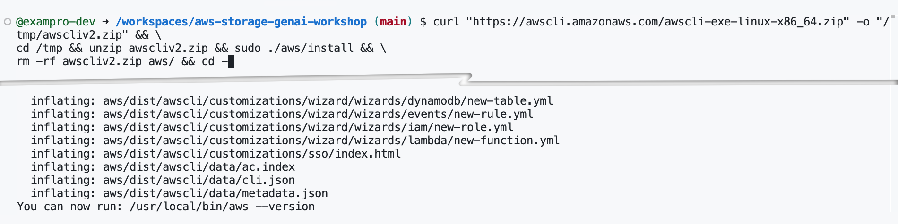

# Setup

## AWS Account Setup

### Enable All Amazon Bedrock Models

1. Drop down the region changer
2. Change your region your to `東京 ap-northeast-1`

</img>

1. In the search bar type `bedrock`
2. Click on Amazon Bedrock to go to this service.

</img>

1. In the left hand column click on `モデルアクセス`

</img>

1. Click on `すべてのモデルを有効にする`

</img>

1. Click on `次へ`

</img>


1. Click on `送信`

</img>

1. See that the models `Nova Pro`, `Nova Canvas` are enabled

</img>


### Setup AWS Infrastructure

- We need the two subnets from the default VPC.
- We need to run this command in CloudShell:

```sh
aws ec2 describe-subnets \
--region ap-northeast-1 \
--filters "Name=vpc-id,Values=$(aws ec2 describe-vpcs --region ap-northeast-1 --filters "Name=is-default,Values=true" --query 'Vpcs[0].VpcId' --output text)" --query 'Subnets[0:2].SubnetId' --output text | tr '\t' ','
```

1. Open CloudShell
2. Paste the AWS CLI command from above
3. Copy the Subnet IDS for the next step

</img>

Lets deploy the following AWS Infrastructure:
- AWS User with AWS Credentials
- S3 Bucket
- RDS Instance

Please click this button to deploy:

1. Write the name for the stack `GenAIStorageStack`
2. Paste in the SubnetIds from the previous step
3. Set the database password `Testing123!`
4. Enable extra permissions
5. Create stack (and wait 5 mins)


</img>

1. Click on outputs
2. See the outputs, we will use them soon.


</img>

<a target="_blank" href="https://console.aws.amazon.com/cloudformation/home?region=ap-northeast-1#/stacks/create/review?templateURL=https://storage-genai-workshop.s3.ap-northeast-1.amazonaws.com/setup.yaml">

</a>

## Prepare GitHub CodeSpaces Environment

1. Click on `Code`
2. Click on `Codespaces`
3. Click on `Create codespace on main`

</img>


1. Install Ruby Libraries by running `bundle install`

```sh
cd /workspaces/aws-storage-genai-workshop 
bundle install
```

</img>

> To install nokogiri will takes 1-2 mins

1. Install AWS CLI

```sh
curl "https://awscli.amazonaws.com/awscli-exe-linux-x86_64.zip" -o "/tmp/awscliv2.zip" && \
cd /tmp && unzip awscliv2.zip && sudo ./aws/install && \
rm -rf awscliv2.zip aws/ && cd -
```

</img>

🎉  **Setup Complete セットアップ完了** 🎉 