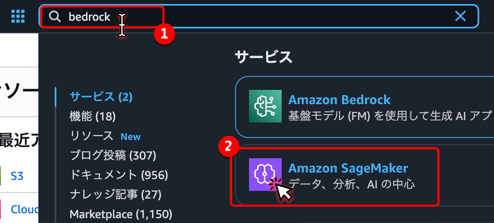
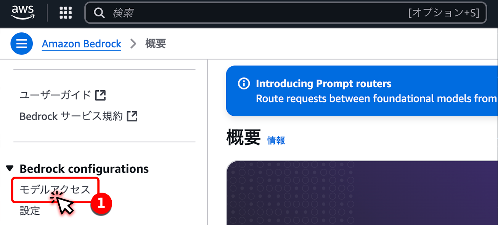
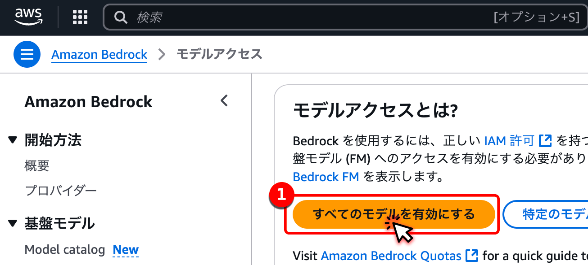
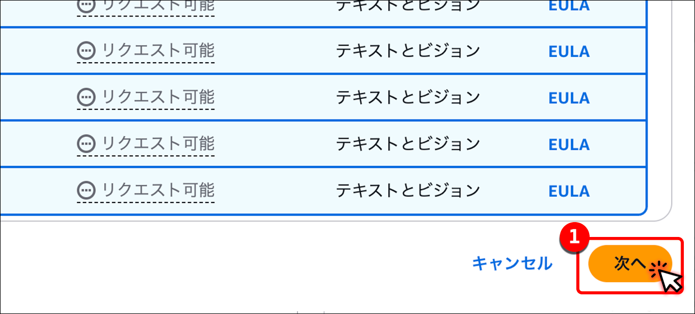
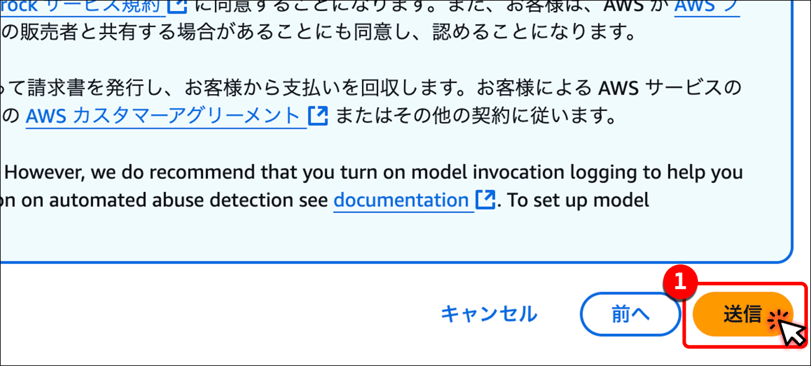
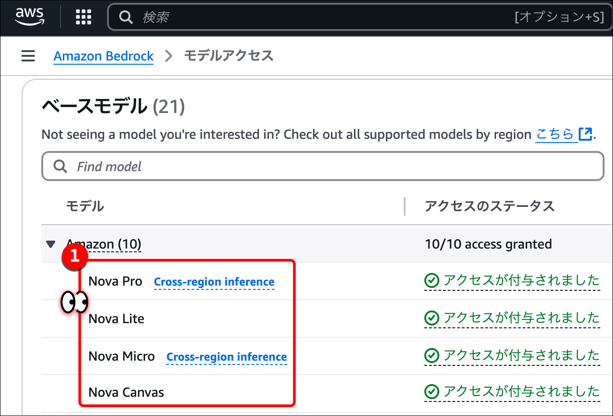

# Setup

## AWS Account Setup

### Enable All Amazon Bedrock Models

1. Drop down the region changer
2. Change your region your to `東京 ap-northeast-1`

</img>

1. In the search bar type `bedrock`
2. Click on Amazon Bedrock to go to this service.

</img>

1. In the left hand column click on `モデルアクセス`

</img>

1. Click on `すべてのモデルを有効にする`

</img>

1. Click on `次へ`

</img>


1. Click on `送信`

</img>

1. See that the models `Nova Pro`, `Nova Canvas` are enabled

</img>


### Generate AWS Credentials

- Let's create a new AWS user with AWS Credentials
- Please click this button to deploy a new user

<a target="_blank" width="100px" href="https://console.aws.amazon.com/cloudformation/home?region=ap-northeast-1#/stacks/create/review?templateURL=https://raw.githubusercontent.com/ExamProCo/aws-storage-genai-workshop/refs/heads/main/cfn/setup_user.yaml">

</a>


## Prepare GitHub CodeSpaces Environment
2. [Generate AWS  for GitHub CodeSpaces](https://us-east-1.console.aws.amazon.com/iam/home?region=ap-northeast-1#/users)


### Install AWS CLI

```sh
curl "https://awscli.amazonaws.com/awscli-exe-linux-x86_64.zip" -o "/tmp/awscliv2.zip" && \
cd /tmp && unzip awscliv2.zip && sudo ./aws/install && \
rm -rf awscliv2.zip aws/ && cd -
```

### Run Bunlder

```sh
bundle install
```